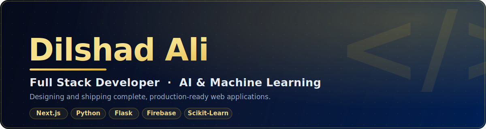

<!--
  ============================================================
  GITHUB PROFILE README  -  Dilshad Ali  (@Dilshad234)
  ------------------------------------------------------------
  Repo name MUST equal username:  Dilshad234
  Files at repo ROOT:  README.md  +  banner.svg
  TODO: replace LINKEDIN-URL, PORTFOLIO-URL and project # links.
  ============================================================
-->

<!-- ===================== BANNER ===================== -->

  

<!-- ===================== ANIMATED TAGLINE ===================== -->

  

<!-- ===================== CONTACT BADGES ===================== -->

  
  
  
  

 

<!-- ===================== PROFILE ===================== -->
## &nbsp;👨‍💻 &nbsp;About Me

Full Stack Developer with hands-on experience designing, building, and deploying modern web applications end-to-end — frontend, backend, authentication, databases, REST APIs, and machine-learning integration. I focus on turning real-world requirements into reliable, production-ready software. Currently open to **internship, trainee, and junior developer** opportunities.

<table>
<tr>
<td valign="top" width="50%">

**What I do**
- Build full-stack web apps with Next.js & React
- Design & implement REST APIs (Flask / FastAPI)
- Integrate authentication, databases & cloud services
- Apply machine learning to real product features
- Ship and maintain deployed applications

</td>
<td valign="top" width="50%">

**At a glance**
- 🎓 &nbsp;BS Computer Science — Iqra University *(final year)*
- 💼 &nbsp;Full Stack Developer with AI/ML project experience
- 🌍 &nbsp;Based in Pakistan · available remotely
- 🌱 &nbsp;Deepening System Design & cloud architecture
- 📫 &nbsp;bhuttodilshad4@gmail.com

</td>
</tr>
</table>

 

<!-- ===================== TECH STACK (centered, brand colors) ===================== -->
## &nbsp;🧰 &nbsp;Tech Stack

<b>Languages</b>

  
  
  
  
  

<b>Frontend</b>

  
  
  
  
  

<b>Backend &amp; APIs</b>

  
  
  
  

<b>Database &amp; Cloud</b>

  
  
  
  
  

<b>AI / ML &amp; Tools</b>

  
  
  
  
  

 

<!-- ===================== FEATURED PROJECTS ===================== -->
## &nbsp;📌 &nbsp;Featured Projects

<!--
  ADD SCREENSHOTS: put images in your repo, e.g. assets/p-health.png,
  then they replace the placeholder links below. Recommended size ~640x360.
-->

<table>
<tr>
<td valign="top" width="50%">

#### 🤖 &nbsp;AI Women Health Assistant
AI-powered healthcare platform for intelligent health-risk prediction and guidance. *(Final Year Project)*

`Next.js` `Flask` `Scikit-Learn` `Firebase`

</td>
<td valign="top" width="50%">

#### 🏫 &nbsp;IU Campus Management System
Role-based platform for request handling and approvals across students, faculty, and admins.

`Next.js` `Flask/FastAPI` `Firebase Auth` `Firestore`

</td>
</tr>
<tr>
<td valign="top" width="50%">

#### 💻 &nbsp;Urdu Mini Compiler
A compiler that processes Urdu-language syntax to demonstrate core compiler-design concepts.

`Python` `Compiler Design` `NLP`

</td>
<td valign="top" width="50%">

#### 🌐 &nbsp;Enterprise Network Design
Enterprise-grade network infrastructure modeled and configured in Cisco Packet Tracer.

`Cisco Packet Tracer` `Routing & Switching`

</td>
</tr>
</table>

<b>More projects</b>

 

| Project | Tech |
|---|---|
| Student Management System | HTML · CSS · JS · SQL |
| React.js Web App | React.js |
| Database Management System | SQL |
| Java OOP Project | Java |
| Dynamic Path Finding (AI) | Python |

 

<!-- ===================== GITHUB ACTIVITY (midnight + gold theme) ===================== -->
## &nbsp;📈 &nbsp;GitHub Activity

  
  

  

  

 

<!-- ===================== CONTACT ===================== -->

  <b>Let's build something.</b> 
  <a href="mailto:bhuttodilshad4@gmail.com">Email</a> &#160;·&#160;
  <a href="https://linkedin.com/in/LINKEDIN-URL">LinkedIn</a> &#160;·&#160;
  <a href="https://PORTFOLIO-URL">Portfolio</a> 
  Open to internship, trainee &amp; junior developer roles.

